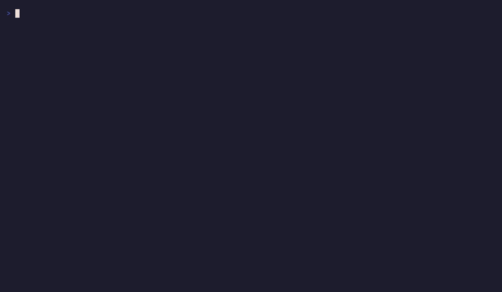

# [fastfetch-configs](https://github.com/iamanuclearwarhead/fastfetch-configs)

a collection of custom aesthetic configurations for [fastfetch](https://github.com/fastfetch-cli/fastfetch).
> this is **not** a fork of fastfetch


> recorded with [vhs](https://github.com/charmbracelet/vhs), regenerate with `vhs demo.tape`

## configs

### 1. minimal
a small distractionless layout, only the essentials with a small logo, works literally in any terminal
> **requires: nothing**

### 2. server
plain ascii layout made for servers and ssh sessions
os, kernel, uptime, ip, cpu, memory, swap, disk, and process count
> **requires: nothing**

### 3. nordic
a cool nord inspired config with rounded box frames (`╭─╮ … ╰─╯`)

> **requires:** nerd font

### 4. gruvbox
warm retro yellows and oranges with a chunky divider and a color circle strip

> **requires:** nerd font

### 5. catppuccin
soft mauve and pink pastels straight outta the catppuccin mocha pallate (and sparkly dividers)

> **requires:** nerd font, truecolor terminal

### 6. tokyonight
neon purple and blue from the tokyonight palette

> **requires:** nerd font, truecolor terminal

### 7. matrix
all green larp nullsec terminal aesthetic `>>` separators, gradient block dividers, process count and local ip. the distro logo is green too. (max opsec)
> using this will result in you being called a larp

> **requires:** nerd font

### 8. verbose
everything fastfetch knows about your machine sorted into **SYSTEM**, **DESKTOP**, and **HARDWARE** sections
> basically `fastfetch -c all` but neat

> **requires:** nerd font


## installation and usage

### quick install (recommended)

```bash
curl -fsSL https://raw.githubusercontent.com/iamanuclearwarhead/fastfetch-configs/main/install.sh | bash
```
> executing this command will fetch the repo and start the installer

### or from a local clone
```sh
git clone https://github.com/iamanuclearwarhead/fastfetch-configs
```

```bash
./install.sh                  # interactive picker
./install.sh nordic           # install a config by name
./install.sh -l               # list available configs
./install.sh -p nordic        # preview a config without installing
```

> your existing `~/.config/fastfetch` is auto backed up to a `fastfetch.bak.*` folder before anything is copied no need to do it manually


## sys requirements 

to make sure all icons and images work correctly,

1. **nerd font:** a nerd font must be active in your terminal (like *JetBrainsMono Nerd Font* or *FiraCode Nerd Font*) to render the status icons
   
2. **image support:** for the custom image logo to render you need a terminal that supports image protocols (like **kitty**, **wezterm**, **foot** with the correct configs)

## license
mit. [license](LICENSE) here
made with <3 and shell
dont be afraid to fork this
